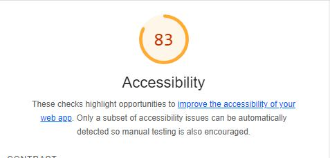

# LAB - Number

## About Me

To utilize the skills and tools I have achieved to showcase a unique and personal webpage dedicated to letting others know just a bit more about me.

### Author: Cody Bonner

### Links and Resources

* [GitHub Class Repo](https://github.com/CodeXAcademyTechnologies/springhill-code-201n4/commit/ff77b63b22cd21301b443c637b5aeca829a959f9#diff-5b7cfc270acf592d917d5acaa1bbdc1a1014fd59a3e11d3404d9c501da91a279)

  [CSS Image Styling](https://www.w3schools.com/css/css3_images.asp)

  [Float element](https://www.w3schools.com/cssref/pr_class_float.php)
* 

### Lighthouse Accessibility Report Score

### Reflections and Comments

Learning Journal 3:

Paper View
This past week has been beneficial to me on a learning experience because not only did I get to continue putting in time learning the fundamentals of the languages I will be using for software development. I also learned the importance in my own practice to fully utilize IDs when it comes to  the relationship between HTML and CSS.

I also learned that while I may have a good deal of knowledge when it comes to computer languages that are used in software development. There's still plenty I haven't learned but that go hand in hand with many ideas I have when it comes to website develop and just how much goes into simple things like displaying an image on alert based on a user response. It's not as simple as I thought which isn't a bad thing. It gives me something exciting to look forward to.

I look forward to learning more and developing my skills further.